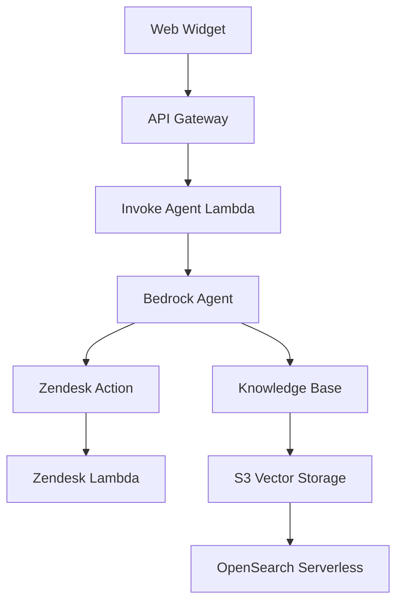

# NovaBot - AWS Bedrock Support Chatbot System


NovaBot is a comprehensive, enterprise-ready AI support chatbot system built on AWS Bedrock. It provides intelligent customer support through multiple channels with knowledge base integration, ticket creation capabilities, and real-time streaming responses.

## 🌟 Features

### Core Capabilities
- **AI-Powered Conversations**: Leverages AWS Bedrock Claude 3.5 Sonnet for intelligent responses
- **Knowledge Base RAG**: Vector-based retrieval augmented generation using Amazon Bedrock Knowledge Bases
- **Streaming Responses**: Real-time message streaming for enhanced user experience
- **Multi-Channel Ready**: Web widget with Amazon Connect scaffolding for future omni-channel support
- **Ticket Integration**: Automated Zendesk ticket creation for complex issues
- **Enterprise Security**: SOC 2 compliant with comprehensive IAM and encryption

### Technical Architecture
- **Infrastructure as Code**: Complete Terraform modules for AWS deployment
- **Serverless Architecture**: AWS Lambda functions with TypeScript
- **Modular Design**: Reusable Terraform modules for different environments
- **CI/CD Pipeline**: GitHub Actions with automated testing and deployment
- **Scalable Storage**: S3 with OpenSearch Serverless for vector storage

## 🏗️ Architecture Overview



## 📋 Prerequisites

### Required Software
- **Terraform**: v1.13.x or later
- **AWS CLI**: v2.x with configured credentials
- **Node.js**: v18.x or later (for Lambda development)
- **Git**: For version control

### AWS Services Required
- Amazon Bedrock (with Claude 3.5 Sonnet model access)
- Amazon Bedrock Knowledge Bases
- AWS Lambda
- Amazon S3
- Amazon API Gateway
- AWS Secrets Manager
- Amazon CloudWatch
- OpenSearch Serverless
- AWS IAM

### Third-Party Services
- **Zendesk Account**: For ticket creation integration
- **GitHub Account**: For CI/CD pipeline (optional)

## 🚀 Quick Start

### 1. Clone the Repository
```bash
git clone https://github.com/your-org/NovaBot.git
cd NovaBot
```

### 2. Configure AWS Credentials
```bash
aws configure
# Enter your AWS Access Key ID, Secret Access Key, and default region
```

### 3. Request Bedrock Model Access
Before deployment, ensure you have access to the required Bedrock models:

1. Go to AWS Console → Bedrock → Model Access
2. Request access to:
   - Claude 3.5 Sonnet v2
   - Titan Embeddings G1 - Text

### 4. Set Environment Variables
Create a `.env` file in the root directory:
```bash
# Copy the example file
cp .env.example .env

# Edit with your specific values
AWS_REGION=us-east-1
PROJECT_NAME=novabot
ENVIRONMENT=dev
ZENDESK_DOMAIN=your-domain.zendesk.com
ZENDESK_EMAIL=your-email@company.com
```

### 5. Deploy Infrastructure
```bash
# Navigate to Terraform directory
cd infra/terraform

# Initialize Terraform
terraform init -backend-config=envs/dev/backend.hcl

# Review the planned changes
terraform plan -var-file=envs/dev/terraform.tfvars

# Apply the infrastructure
terraform apply -var-file=envs/dev/terraform.tfvars
```

### 6. Upload Knowledge Base Data
```bash
# Upload sample data to the created S3 bucket
aws s3 cp data/knowledge_base/ s3://your-knowledge-base-bucket/ --recursive
```

### 7. Configure Zendesk Integration
1. Store your Zendesk credentials in AWS Secrets Manager:
```bash
aws secretsmanager create-secret \
    --name "novabot/zendesk/credentials" \
    --description "Zendesk API credentials for NovaBot" \
    --secret-string '{"email":"your-email@company.com","token":"your-api-token"}'
```

### 8. Deploy Web Widget
Copy the widget files to your web server or CDN:
```bash
# Copy widget files to your web server
cp web/widget/* /path/to/your/webserver/novabot/
```

Add the widget to your website:
```html
<!-- Add before closing </body> tag -->
<script src="https://your-domain.com/novabot/widget.js"></script>
<script>
NovaBot.init({
    apiUrl: 'https://your-api-gateway-url',
    theme: 'light',
    position: 'bottom-right'
});
</script>
```

## 📚 Documentation

### Setup Guides
- [Complete Setup Guide](./docs/setup/complete-setup.md)
- [AWS Configuration](./docs/setup/aws-configuration.md)
- [Terraform Deployment](./docs/setup/terraform-deployment.md)
- [Environment Configuration](./docs/setup/environment-configuration.md)

### Architecture Documentation
- [System Architecture](./docs/architecture/system-overview.md)
- [Data Flow](./docs/architecture/data-flow.md)
- [Security Model](./docs/architecture/security.md)
- [Scalability Considerations](./docs/architecture/scalability.md)

### API Documentation
- [API Reference](./docs/api/reference.md)
- [Authentication](./docs/api/authentication.md)
- [Error Handling](./docs/api/error-handling.md)
- [Rate Limiting](./docs/api/rate-limiting.md)

### Development Guides
- [Local Development](./docs/development/local-development.md)
- [Testing Strategy](./docs/development/testing.md)
- [Contributing Guidelines](./docs/development/contributing.md)
- [Code Style Guide](./docs/development/code-style.md)

## 🔧 Configuration

### Environment Variables

| Variable | Description | Default | Required |
|----------|-------------|---------|----------|
| `AWS_REGION` | AWS region for deployment | `us-east-1` | Yes |
| `PROJECT_NAME` | Project name for resource naming | `novabot` | Yes |
| `ENVIRONMENT` | Environment (dev/prod) | `dev` | Yes |
| `ZENDESK_DOMAIN` | Your Zendesk subdomain | - | Yes |
| `ZENDESK_EMAIL` | Zendesk user email | - | Yes |
| `ENABLE_CONNECT` | Enable Amazon Connect | `false` | No |
| `LOG_LEVEL` | Logging level | `INFO` | No |

### Terraform Variables

Key Terraform variables in `terraform.tfvars`:

```hcl
# Core Configuration
project_name = "novabot"
environment = "dev"
aws_region = "us-east-1"

# Knowledge Base Configuration
knowledge_base_name = "novabot-knowledge-base"
enable_knowledge_base = true

# Bedrock Configuration
bedrock_agent_name = "novabot-agent"
bedrock_model_id = "anthropic.claude-3-5-sonnet-20241022-v2:0"

# API Configuration
api_name = "novabot-api"
enable_cors = true

# Security Configuration
enable_waf = true
enable_cloudtrail = true

# Monitoring Configuration
enable_detailed_monitoring = true
log_retention_days = 30
```

## 🧪 Testing

### Running Tests
```bash
# Install dependencies
npm install

# Run unit tests
npm test

# Run integration tests
npm run test:integration

# Run end-to-end tests
npm run test:e2e

# Run tests with coverage
npm run test:coverage
```

### Test Structure
- **Unit Tests**: Individual function and module testing
- **Integration Tests**: API endpoint and service integration testing
- **End-to-End Tests**: Complete user workflow testing
- **Load Tests**: Performance and scalability testing

## 🚨 Troubleshooting

### Common Issues

#### Deployment Fails
1. **Bedrock Model Access**: Ensure you have requested access to required models
2. **IAM Permissions**: Verify your AWS credentials have sufficient permissions
3. **Region Availability**: Confirm Bedrock is available in your chosen region

#### Widget Not Loading
1. **CORS Configuration**: Check API Gateway CORS settings
2. **API Key**: Verify the API Gateway is properly configured
3. **Network**: Check for firewall or network restrictions

#### Knowledge Base Issues
1. **File Format**: Ensure uploaded files are in supported formats (PDF, TXT, CSV, DOCX)
2. **Indexing**: Allow up to 15 minutes for content indexing
3. **Permissions**: Verify S3 bucket permissions and IAM roles

### Getting Help

- **Documentation**: Check the [troubleshooting guide](./docs/troubleshooting/common-issues.md)
- **Issues**: Create an issue on GitHub for bugs or feature requests
- **Discussions**: Use GitHub Discussions for questions and community support

## 🔒 Security

### Security Features
- **Encryption at Rest**: All data encrypted using AWS KMS
- **Encryption in Transit**: TLS 1.3 for all communications
- **IAM Best Practices**: Least privilege access controls
- **Secrets Management**: Secure credential storage with AWS Secrets Manager
- **Network Security**: VPC isolation and security groups
- **Audit Logging**: Comprehensive CloudTrail logging

### Security Best Practices
1. **Regular Updates**: Keep dependencies updated
2. **Access Review**: Regularly review IAM permissions
3. **Monitoring**: Enable CloudWatch alerts for suspicious activity
4. **Backup**: Regular backup of configuration and data
5. **Incident Response**: Have a plan for security incidents

## 📊 Monitoring and Observability

### Metrics and Logging
- **CloudWatch Metrics**: Custom metrics for API performance
- **CloudWatch Logs**: Structured logging for all components
- **X-Ray Tracing**: Distributed tracing for request flow
- **Custom Dashboards**: Pre-built CloudWatch dashboards

### Key Metrics
- **Response Time**: API and Lambda function performance
- **Error Rates**: Error tracking and alerting
- **Usage Patterns**: Conversation volume and patterns
- **Cost Tracking**: AWS service usage and costs

## 🚀 Deployment Options

### Development Environment
- Single region deployment
- Minimal redundancy
- Development-optimized configurations
- Lower cost settings

### Production Environment
- Multi-region deployment option
- High availability configuration
- Enhanced security settings
- Production-grade monitoring

### Enterprise Features
- **Amazon Connect Integration**: Omni-channel support
- **Advanced Analytics**: Enhanced reporting and insights
- **Custom Integrations**: Tailored third-party integrations
- **Dedicated Support**: Premium support options

## 🤝 Contributing

We welcome contributions! Please see our [Contributing Guidelines](./docs/development/contributing.md) for details.

### Development Process
1. Fork the repository
2. Create a feature branch
3. Make your changes
4. Add tests for new functionality
5. Submit a pull request

### Code Standards
- Follow TypeScript best practices
- Use ESLint and Prettier for code formatting
- Write comprehensive tests
- Document new features

## 📄 License

This project is licensed under the MIT License - see the [LICENSE](LICENSE) file for details.

## 🙏 Acknowledgments

- **AWS Bedrock Team** - For the powerful AI capabilities
- **Anthropic** - For the Claude 3.5 Sonnet model
- **Open Source Community** - For the excellent tools and libraries

## 📞 Support

For support and questions:

- **Documentation**: [https://docs.novabot.com](https://docs.novabot.com)
- **GitHub Issues**: Create an issue for bugs or feature requests
- **GitHub Discussions**: Community discussions and Q&A
- **Email**: support@novabot.com (for enterprise customers)

## 🗺️ Roadmap

### Short Term (Q1 2025)
- [ ] Enhanced widget customization options
- [ ] Additional language model support
- [ ] Improved analytics dashboard
- [ ] Mobile SDK development

### Medium Term (Q2-Q3 2025)
- [ ] Voice integration capabilities
- [ ] Advanced workflow automation
- [ ] Multi-tenant architecture
- [ ] Enhanced security features

### Long Term (Q4 2025+)
- [ ] On-premises deployment options
- [ ] Advanced AI model fine-tuning
- [ ] Comprehensive partner ecosystem
- [ ] Global edge deployment

---

**NovaBot** - Intelligent Customer Support, Powered by AWS Bedrock

Built with ❤️ by the NovaBot Team
